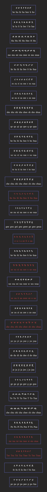

⚠️ The code is in beta. Some of the transcribing may not work as intended!

## Installation
Before getting started, ensure that git is installed on your computer.
```shell
$ git clone https://github.com/mellash/hahu
$ cd hahu
```

## What is hahu (ሀሁ)?
hahu (ሀሁ) is a command-line tool for transcribing English text into Amharic text.

## How to Run
```shell
$ cd hahu
$ javac -d . Main.java Transcribe.java Letters.java
$ java hahu.Main
```

## Hahu letters (ሀሁ ፊደላት)
- The 🔴 colored letters (ፊደላት) are for indicating I still didn't figure out suitable characters for them.




## Contribution
Any contribution is acceptable.
